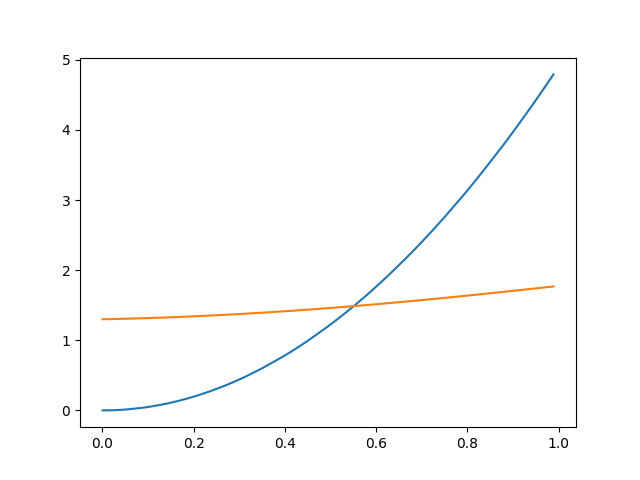

# Homework 1

## Due  
**Sunday Feb 5, 11:59PM US Central time**

## Coding assignment

In the first week of the class, we saw a demo that an arbitrary neural network can learn the "law" of free falling $h=\frac{1}{2}gt^2$ as a function $h=f(t)$ starting from knowning nothing about physics. It learns from simulated data that follow the $h=\frac{1}{2}gt^2$ "law". Given a time elapsed, the neural network can predict the distance the free falling object travels. 

Now you are expected to implement a function visualizing the groundtruth and the predictions given the same set of time points. You should obtain something like the figure blow:

### Files
1. `1_intro.ipynb` for those who wants to develop and run on a cloud Jupyter environment such as Google CoLab or DeepNote. This file also contains some example code that provides hints for the homework. 
2. `hw1.py` this is where you submit your homework

### Anatomy of functions
1. The time points are generated by the function `generate_data` that returns both the time points and groundtruth distances corresponding to those time points. 
2. The function `test_NN` training a neural network using the data generated above, and use the same neural network to predict on the same time points used in training. 
3. The function `learning_curve` is what you are expected to implement. It shall make two plots. One is groundtruth used in training with respect to time points. The other is the predictions with respect to time points. Both the training data and the groundtruth should have the same length. 

### Speficiations for the function `learning_curve` 

Please folow the specifications carefully, such as using the right colors. Otherwise, the auotgrader will give you zero. 

1. The function takes three arguements, 
   * `N`, of type `int`, is the number of data points, 
   * `max_iter`, also of type `int`, is the number of iterations to train the neural network
   * `filename`, of type `str`, is where the visualization is saved. 
2. The function returns a hash digest of the `filename`. It is for you to self-check the correctness of your implementation. The TA will also use this value to grade your submission. If you execute on DeepNote, for `learning_curve(500, 300, "test.png")` , the return hash shall be `4b2737555fbaabffba658659a7cd53ed`. If you get the same number, then you are correct.
2. `learning_curve` shall first call `generate_data` to generate `N` data points (two parts, times `Ts` and heights `Hs`), then pass the data points to `test_NN` function to obtain the predictions and the score, the latter of which is not needed. 
3. Finally, you visualize the ground truth and the prediction using `matplotlib.pyplo.plot` as shown in one cell in `1_intro.ipynb`. 
4. It shall plot two [lines](https://en.wikipedia.org/wiki/Line_chart) in two distinctive colors. For the groundtruth, use BLUE (color code `tab:blue`), and for the prediction, use ORANGE (color code `tab:orange`). Regarding how to change colors in line plots, see the demo in `1_intro.ipynb`. 
5. For every plot setting else, leave to default settings. 
6. Use 4-space indentations. No tabs. 

## How to submit: 

Please follow the instruction strictly. 

Please insert your implementation to the function `learning_curve` into `hw1.py`. Do NOT modify anothing else. Code and comments left beyond the body of the function `learning_curve` will not be used for grading. Comments will not be used either. The grading is done automatically by code. So the TAs will not read your comments nor print outs. 

Then, submit `hw1.py` to Canvas. Just upload it. 