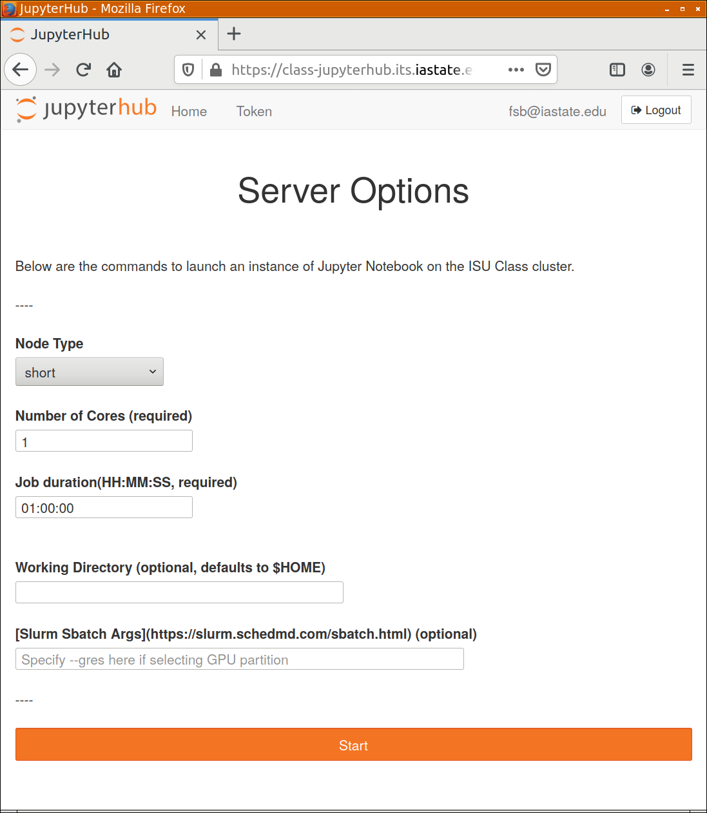
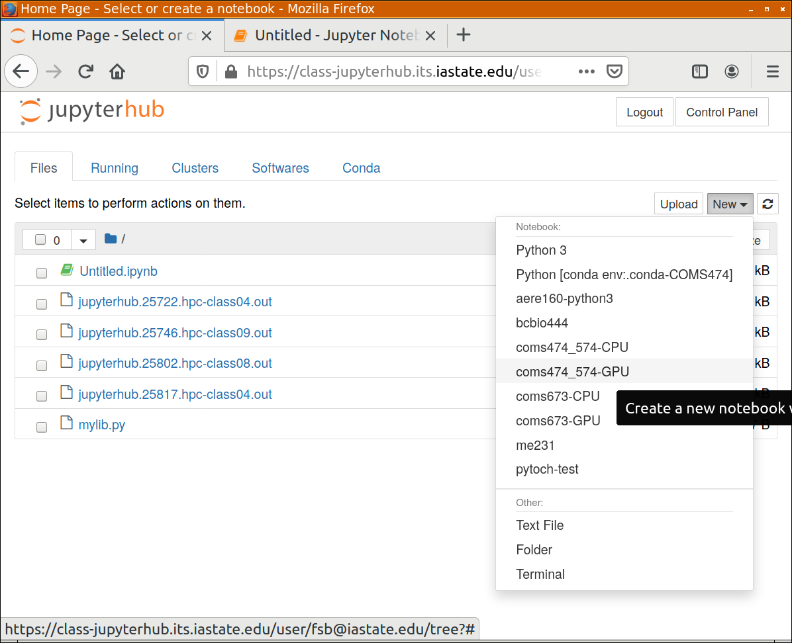
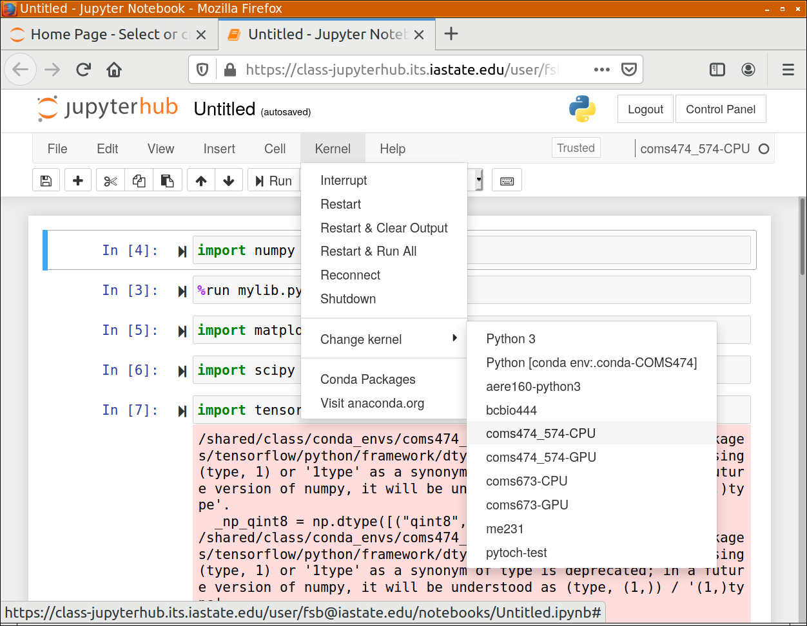

# Jupyter hub instructions
If you have problems setting up Python, Numpy, or Matplotlib on your own computer, you can launch your own Jupyter server on ISU's infra. Go to https://class-jupyterhub.its.iastate.edu  and follow the instructions here https://www.hpc.iastate.edu/guides/jupyterhub

You need to connect to ISU's VPN to use it. All packages needed for this class, numpy, scipy, matplotlib, and tensorflow are installed. Just select the proper kernel (see below). 

# (Re-)Launch your server

The interface has changed slightly from what was in the instruction above. This section here is to clarify the discrepancy. 

If you see a Launch Server page like below, just click `Launch Server`. 

 You will see a window like below: 

Then you need to select a node type: 
* `short` is generic - normally this is what you should select. 
* `mem` is for memory-intensive cases, which is not normally needed in this class. 
* `debug` unsure. Avoid for now. 
* `gpu` is when you want to use GPU computing via CUDA -- needed toward the end of the semester. 

For Number of Cores, just select 1 in most cases. 

For Job Duration, set as 1 hour. When the 1 hour expires, you can come back to  https://class-jupyterhub.its.iastate.edu  to re-launch your server. Rest assured that all your files are there. 

# Select the correct Jupyter kernel 

Once spawened, you will see an interface like below where you can create new notebooks or upload existing notebooks (`*.ipynb`) or Python scripts (`*.py`). It's important to ensure that the correct Jupyter kernel is used to execute them. 

When creating a new notebook, please select the `coms474_574-CPU` or `coms474_574-GPU` (if you created the node type as GPU in the previous step ). This will associate your newly created notebook with that kernel - until you change it. 

You may also upload files by clicking the `Upload` button. Files uploaded will appear under `Files` tab. 

To select the kernel for a Jupyter notebook, first open the Jupyter notebook. Then select a proper kernel as below: 
 Again, select  `coms474_574-CPU` for most of the semester or `coms474_574-GPU` only when need to use GPUs via CUDA.

You may import functions defined in Python scripts (`*.py`) in a Jupyter notebook, or execute the script from an Jupyter notebook like `%run your_script.py`. However, do not run the script from Terminal as the COMS474/574 kernel is not accessible from Terminal. 

# What you should NOT do
You should not need to install new pacakages. So skip the "Creating custom conda environments" section in [this link](https://www.hpc.iastate.edu/guides/jupyterhub).  

Do not do things prohibited on ISU computers. 

Do not do evil things, such as developing NLP algorithms to assist a foreign government to censor the Internet. 